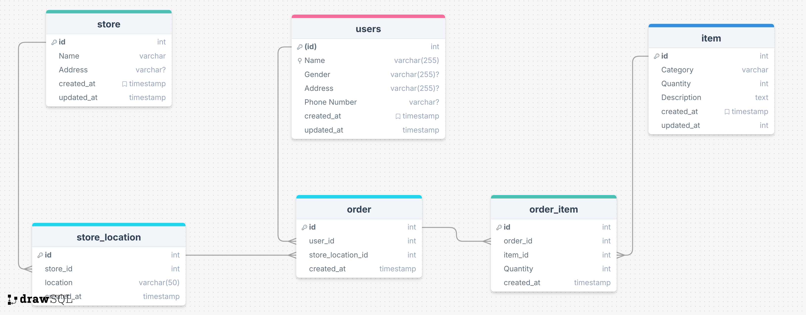

## 1. Schema Design



- table **users** : store personal user or customer information 
- table **item** : store item that are in sales
- table **store** : store basic information for each store
- table **store_location** : relation between store and location, assuming in one location can have 2 or more store
- table **order** : store order data by user and specific store
- table **order_item** : sales detail from order, since one order can have multiple item

## 2. Design performance for write and read

let's say we want to insert 50 million sales data, which is a lot and will take some time. After the data got inserted into order and order_item table, the next problem will be read data issue. there are several way that can be solution to achieve better read performance:

1. create index on order and order_item tables, this will make read much more faster if we fetch a few rows.
2. partition table, we can partition the order tables by date (months) or by store location id, this will make the query to only read from certain part of the child tables, theoretically it still one table but physically the table will be devided into several child tables based on the column that we partitioned on.

```sql
-- on pg13, partman 4.2.0
CREATE TABLE public.order_v2 (LIKE public.order INCLUDING DEFAULTS) PARTITION BY RANGE (date(created_at));

CREATE TABLE partman.order_template (LIKE public.order INCLUDING ALL);

SELECT partman.create_parent(
  p_parent_table => 'public.order_v2',
  p_control => 'created_at', 
  p_type => 'native', 
  p_interval => 'monthly', 
  p_constraint_cols => NULL, 
  p_premake => 4, 
  p_automatic_maintenance => 'on', 
  p_start_partition=> '2024-01-01', 
  p_inherit_fk => true, 
  p_epoch => 'none', 
  p_upsert => '', 
  p_publications => NULL, 
  p_trigger_return_null => true, 
  p_template_table => 'partman.order_template', 
  p_jobmon => false);
```

order table that already partitioned by date will look like this:
